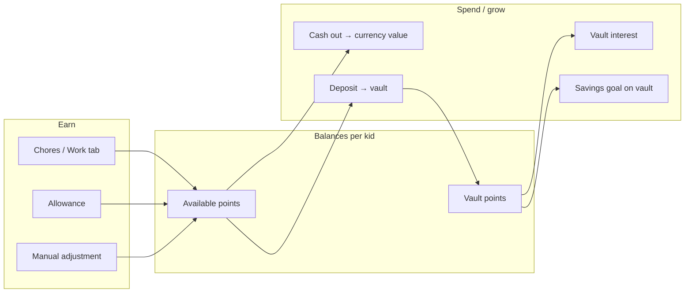

# KidsRewards — Functionality Analysis

> **Shipping:** [FreeDistribution.md](./FreeDistribution.md) — $0 install and backup.  
> **Scope:** [PreRelease.md](./PreRelease.md) — out of scope, misplaced UI, release verdict.

Technical reference for the current codebase (local SwiftUI, KidCoin UI, **free build** with iCloud UI disabled).

---

## Product model

KidsRewards is a **local-only, parent-managed family points app**. No server, no real payments, no subscriptions, no in-app purchases. **Backup (default build):** export/import JSON. iCloud key-value code exists but is off via `AppDistribution.iCloudKeyValueBackupEnabled = false` until a paid Apple Developer account is used.



**Core loop:** Parents define chores and economy → kids earn **available** points → deposit to **vault**, interest, goals, **cash out** at a configured rate (ledger only; parents pay separately).

---

## Architecture

```
KidsRewardsApp
  └── AppRootView (loading screen)
        └── ContentView (PIN gate | Child mode | Tab bar)
              ├── DashboardView → KidDetailView → KidAvailableView / KidVaultView
              ├── TasksView
              └── SettingsView
        RewardStore (@MainActor, JSON file; iCloud gated by AppDistribution)
        AppRouter (tabs, child mode, approvals focus)
        KeychainParentPINManager
```

**State (`RewardState`):** kids, tasks, settings, transactions, approvalRequests, taskCompletions.

**Persistence:** `kids-rewards-state.json` in Documents. Parent PIN in Keychain (not in exported JSON).

---

## Implemented features

### Shell

- Three tabs (Kids, Work, Settings), KidCoin design system, launch storyboard, loading screen (~850ms), custom tab bar with scroll clearance, UI-test launch flag (`--ui-testing-reset`).

### Home dashboard

- Kids CRUD; household totals, cash value, points earned this week; needs-attention cards; quick actions; rich kid cards; recent activity (8); exchange-rate footnote.

### Per kid (parent)

- Award chores (assignment + daily/weekly recurrence); available (cash out partial, adjust, allowance + per-kid override + schedule); vault (deposit, withdraw, interest manual/scheduled, savings goal); history correct/delete.

### Work

- Chore catalog: add/edit/delete; points, recurrence; Everyone / Selected assignment.

### Settings

- Currency, points per dollar, vault interest rate, interest schedule (off/daily/weekly), notifications toggle, parent PIN + biometrics, approval flow + queue, JSON export/import with preview, free-build backup footnote. iCloud controls hidden unless `ICloudBackup.isAvailable`.

### Child mode

- Profile picker (multiple kids); balances; request chore / deposit / cash out (partial) / interest when approval on; savings progress; full history; explainer when approval off. Entry from PIN gate or home.

### Parent safety

- PIN gate, background re-lock, 5 failures → 60s lockout, Face ID / Touch ID.

### Automation

- Due allowance and interest on app open/foreground (calendar week for weekly); approval queue for scheduled allowance/interest when flow on; local notification plans.

### Backup

- Atomic local JSON; import/export; optional iCloud envelope (v3) when paid build enabled; `disableICloudBackupIfUnavailable()` on launch.

### Tests

- ~100 `RewardStore` unit tests; 3 UI tests; [BiometricValidation.md](./BiometricValidation.md) for devices.

| Area | Store | UI | Unit tests |
|------|-------|-----|------------|
| Core flows (kids, chores, balances, cash out, vault, allowance, approvals, child mode, PIN) | Yes | Yes | Yes |
| JSON backup | Yes | Yes | Yes |
| iCloud backup | Yes | Hidden (free build) | Yes (test override) |
| Reports, IAP, real payments | No | No | N/A |

---

## Not implemented (by design or deferred)

### Out of scope

- Payment rails, bank links, user accounts, sign-in.
- Reports, charts, transaction search/filter, CSV/PDF export.
- Onboarding wizard, localization, dark mode.
- Merge/partial import; multi-device auto-sync in free build (use JSON export/import).
- Kid-initiated manual adjust; archive kid (delete is permanent).
- In-app purchases, ads, subscriptions.

### Data and platform limits

- Destructive full-state import; no conflict merge.
- No versioned schema migration framework (`Codable` defaults + cloud `schemaVersion` only).
- iCloud KV (~1 MB) only if paid build enabled — see [iCloudEntitlement.md](./iCloudEntitlement.md).
- App Store / TestFlight requires paid Apple Developer Program — see [FreeDistribution.md](./FreeDistribution.md).

### Polish and IA (open)

See [PreRelease.md](./PreRelease.md) §5.3 and §6: attention rows without navigation, kid name in nav title, allowance config location, approval queue discoverability, branding string consistency, thin UI tests.

### Qualified behavior

- Scheduled allowance/interest runs when the app opens, not in true background.
- Notifications require OS permission.
- One pending approval per kid per kind (new replaces old).
- Savings goal progress = available + vault.
- Weekly recurrence = calendar week (Sunday-based).

---

## Key files

| Path | Role |
|------|------|
| `KidsRewards/KidsRewardsApp.swift` | Entry, maintenance on foreground |
| `KidsRewards/Views/AppRootView.swift` | Loading gate |
| `KidsRewards/Views/ContentView.swift` | PIN, child mode, tabs |
| `KidsRewards/Views/DashboardView.swift` | Home dashboard |
| `KidsRewards/Stores/AppRouter.swift` | Navigation helpers |
| `KidsRewards/Views/KidDetailView.swift` | Award, history |
| `KidsRewards/Views/KidAvailableView.swift` | Cash out, adjust, allowance |
| `KidsRewards/Views/KidVaultView.swift` | Vault actions, goal |
| `KidsRewards/Views/TasksView.swift` | Chore catalog |
| `KidsRewards/Views/SettingsView.swift` | Economy, PIN, queue, backup |
| `KidsRewards/Stores/RewardStore.swift` | Business logic |
| `KidsRewards/Stores/AppDistribution.swift` | Free vs paid flags |
| `KidsRewards/Models/RewardModels.swift` | Types |
| `KidsRewards/Stores/ParentPINSecurity.swift` | PIN + biometrics |
| `KidsRewardsTests/RewardStoreTests.swift` | Unit tests |

---

## Related docs

- [FreeDistribution.md](./FreeDistribution.md) — $0 install and backup
- [PreRelease.md](./PreRelease.md) — missing, misplaced UI, verdict
- [BiometricValidation.md](./BiometricValidation.md) — device checklist
- [iCloudEntitlement.md](./iCloudEntitlement.md) — optional paid-program iCloud
- [../README.md](../README.md) — quick start
