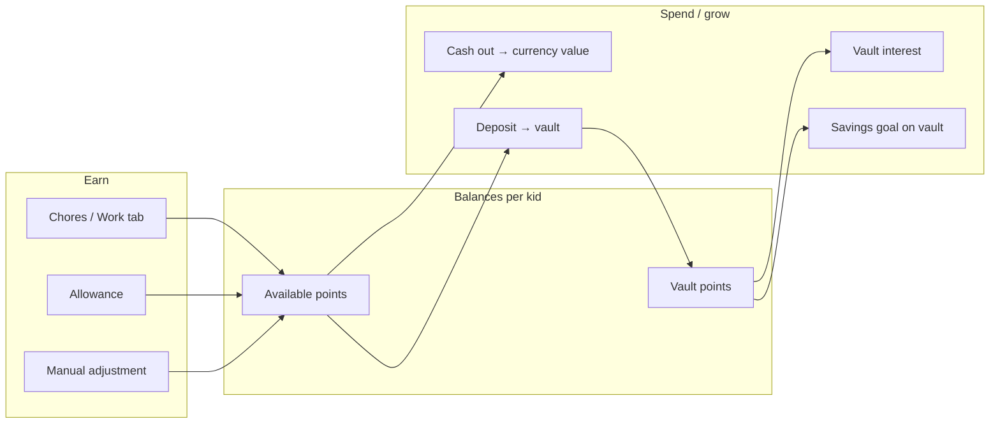

# KidsRewards — Functionality Analysis

This document describes what the app implements today, what is partial or missing, and suggested priorities for evolving beyond the draft. It reflects the codebase as of the current draft (local SwiftUI app, KidCoin design language).

---

## Product model

KidsRewards is a **local-only, parent-managed family points app**. There is no server, no real payments, and no live multi-device sync—only optional manual iCloud key-value backup.



**Core loop:** Parents define chores and economy settings → kids earn into **available** → parents/kids move value to **vault**, apply **interest**, set **goals**, and **cash out** at a configured rate.

---

## Architecture snapshot

```
KidsRewardsApp
  └── AppRootView (loading screen)
        └── ContentView (PIN gate | Child mode | Tab bar)
              ├── DashboardView → KidDetailView → KidAvailableView / KidVaultView
              ├── TasksView
              └── SettingsView
        RewardStore (@MainActor, JSON file + optional iCloud KV)
        KeychainParentPINManager
```

**State model (`RewardState`):** kids, tasks, settings, transactions, approvalRequests, taskCompletions.

**Persistence:** `kids-rewards-state.json` in the app Documents directory. Parent PIN is stored in Keychain, not in exported JSON.

---

## What is already implemented

### App shell and UX

| Area | Status |
|------|--------|
| SwiftUI app with 3 tabs (Kids, Work, Settings) | Done |
| KidCoin design system (cream, coral, mint, tiles, pills) | Done |
| Launch storyboard + animated loading screen (~850ms) | Done |
| `AppRootView` skips loading for UI tests (`--ui-testing-reset`) | Done |
| Custom tab bar, modals, empty states | Done |

### Kids and household dashboard

- Add, rename, delete kids (delete removes their transactions, approvals, and task completions).
- Household totals: available + vault across all kids.
- Per-kid row with balances; navigation to kid detail.
- Exchange rate hint on dashboard (e.g. “10 points = $1.00”).

### Kid detail (main parent workflow)

- **Available** tile → `KidAvailableView` (cash out, manual adjustments, allowance).
- **Vault** tile → `KidVaultView` (deposit, interest, savings goal).
- **Award work** — one-tap award from the global chore list; respects daily/weekly recurrence per kid.
- **History** — transaction ledger with correct/delete (reverses balance when safe).

### Economy settings (`SettingsView`)

- Currency code (ISO, normalized on save).
- **Points per dollar** in the UI (stored internally as `currencyPerPoint`).
- Vault interest rate (decimal; applied **manually** per kid).
- Parent PIN (Keychain, hashed; legacy plain PIN migrated out of JSON).
- Approval flow toggle + **approval queue** (approve/decline).
- Export / import JSON (file picker; replace-all with preview).
- Manual **Sync to iCloud** / **Restore iCloud** (key-value store envelope, schema v2).

### Work / chores (`TasksView`)

- Global chore catalog (same list for every kid).
- Add chore (title + points at create time).
- Edit chore: title, points, recurrence (Off / Daily / Weekly).
- Delete chore (clears completion tracking for that task).

### Money actions

| Action | Store API | Parent UI | Child mode |
|--------|-----------|-------------|------------|
| Award chore | `award` / `requestChoreCompletion` | Kid detail | Request completion (if approval on) |
| Deposit available → vault | `deposit` / `requestDeposit` | Vault screen (queues if approval on) | Request deposit (if approval on) |
| Cash out available | `cashOut` / `requestCashOut` | Available screen | Partial amount request (if approval on) |
| Vault interest | `applyInterest` / `requestInterest` | Vault screen | Request only |
| Manual +/- points | `adjust` | Available screen | View in history only |
| Allowance (one kid / all) | `applyAllowance` / `requestAllowance` | Available screen | No (parent approves when flow on) |
| Auto allowance on app open | `applyDueAllowanceIfNeeded` | Implicit at store init | No |
| Savings goal | `updateSavingsGoal`, `clearSavingsGoal` | Vault screen | View progress only |
| Fix history | `correctTransaction`, `deleteTransaction` | Kid detail | No |

### Parent safety

- PIN gate blocks parent tabs until unlock (unless no PIN is set).
- Parent session re-locks when the app leaves the foreground.
- After five failed PIN attempts, unlock is blocked for 60 seconds.
- Face ID / Touch ID unlock via `LocalAuthentication`.
- **Child mode** — balances, savings progress, chore completion requests, vault deposit requests, partial cash out / interest requests (when approval flow is on), and full per-kid transaction history.
- PIN stored in Keychain; not included in exported settings JSON (covered by unit tests).

### Approval flow

- When enabled: chore completion, vault deposit, allowance, cash out, and interest become **requests**; parent approves in the Settings queue.
- One pending request per kid per kind (a new request replaces the previous one).
- Child mode explains when approval flow is disabled.

### Persistence and backup

- Single JSON file with atomic write; `persistenceErrorMessage` shown in Settings on failure.
- Import/export round-trip; cloud envelope includes metadata (`savedAt`, `deviceName`, `schemaVersion`).
- Tests ensure seeded initial state is not overwritten by an unrelated file on disk.

### Test coverage

- **~34 unit tests** on `RewardStore` (economy, PIN, approvals, allowance, import, transactions).
- **3 UI tests** (tabs, settings when no PIN) using `--ui-testing-reset`.
- **Biometric validation** checklist for physical devices: `Docs/BiometricValidation.md`.

---

## Feature matrix

| Feature | Store logic | UI | Unit tests |
|---------|-------------|-----|------------|
| Kids CRUD | Yes | Yes | Partial |
| Chores CRUD + recurrence | Yes | Yes | Yes |
| Per-kid chore assignment | Yes | Yes | Yes |
| Chore completion approval | Yes | Yes | Yes |
| Scheduled interest (daily/weekly) | Yes | Yes | Yes |
| Local notifications | Yes | Yes | Yes |
| Award work | Yes | Yes | Yes |
| Available / vault balances | Yes | Yes | Yes |
| Deposit | Yes | Yes | Implicit |
| Cash out | Yes | Yes | Yes |
| Interest (manual) | Yes | Yes | Yes |
| Savings goal | Yes | Yes | Yes |
| Manual adjustment | Yes | Yes | Yes |
| Allowance manual / auto | Yes | Yes | Yes |
| Transaction edit / delete | Yes | Yes | Yes |
| Parent PIN | Yes | Yes | Yes |
| Biometrics | Yes | Yes | Manual doc only |
| Child mode | Yes | Yes | Yes |
| Approval flow | Yes | Yes | Yes |
| JSON backup | Yes | Yes | Yes |
| iCloud backup | Yes | Yes | Yes |
| Loading / launch | N/A | Yes | Skipped in UI tests |
| Vault → available withdraw | Yes | Yes | Yes |
| Notifications | Yes | Yes | Yes |
| Live multi-device sync | Partial | Yes | Yes |

---

## What is missing, partial, or weak

### Core product gaps — status

| Topic | Status |
|-------|--------|
| Real money movement | **Clarified in UI.** Cash out records the amount; copy explains parents pay separately (no payment rails). |
| Family cloud / sync | **Improved.** Optional auto-sync to iCloud KV on save + pull when app becomes active; manual export/import remains. Requires iCloud capability on the signing team. |
| Vault → available withdrawal | **Implemented.** Vault screen withdraw action + `withdrawn` transaction type. |
| Per-kid chores | **Implemented.** Assign chores to specific kids in Work tab; empty assignment = all kids. |
| Chore completion approval | **Implemented.** Child mode can request chore completion; parents approve in Settings queue. |
| Scheduled interest | **Implemented.** Daily/weekly automatic interest when the app runs scheduled maintenance. |
| Background allowance | **Implemented.** Due allowance on app launch and when returning to foreground; local notifications scheduled. |
| Notifications | **Implemented.** Reminders for allowance, interest, and pending approvals (toggle in Settings). |

### UX and workflow gaps

_All items from the former batch (per-kid assignment UX, child profile picker, deposit/allowance approval, parent re-lock, PIN lockout, savings goal progress, calendar-week recurrence, per-kid allowance) are implemented with unit tests._

### Data, sync, and reliability

| Gap | Notes |
|-----|--------|
| iCloud requires paid Apple Developer Program | Personal/free teams cannot use the iCloud KV entitlement. The project ships with an empty entitlements plist so device builds succeed; re-add `com.apple.developer.ubiquity-kvstore-identifier` in Xcode when using a paid team. |
| iCloud KV size limits | Large histories may approach key-value storage practical limits (~1 MB). |
| Import is destructive replace | No merge, diff, or partial import. |
| No conflict resolution | Last manual sync wins; no multi-device strategy. |
| Cloud metadata uses `processName` | Not a human-friendly device name. |
| No schema migration framework | `schemaVersion: 2` on cloud envelope only; no versioned migrations for `RewardState` shape changes. |
| Delete kid is permanent | No archive or soft delete. |

### Reporting and polish

| Gap | Notes |
|-----|--------|
| No charts / reports | No weekly earnings, cash-out totals, or kid comparisons. |
| No transaction filters | History is one chronological list per kid. |
| No CSV / PDF export | JSON only. |
| No onboarding | Empty states help but there is no guided setup. |
| No localization | English-only strings. |
| Fixed light theme | No dark mode. |
| README outdated | Root `README.md` still describes early scope (e.g. “currency per point”) and omits PIN, child mode, allowance, approvals, iCloud. |

### Testing and production readiness

| Gap | Notes |
|-----|--------|
| Thin UI tests | No automated flows for kid CRUD, award, vault, PIN, or approvals. |
| Biometrics not in CI | Covered by manual device checklist only. |
| Draft positioning | README states the app is a product/UX draft, not production-ready. |

---

## Key files

| Path | Role |
|------|------|
| `KidsRewards/KidsRewardsApp.swift` | App entry, store creation, UI-test PIN stub |
| `KidsRewards/Views/AppRootView.swift` | Loading screen gate |
| `KidsRewards/Views/ContentView.swift` | PIN gate, child mode, tab shell |
| `KidsRewards/Views/DashboardView.swift` | Household / kids list |
| `KidsRewards/Views/KidDetailView.swift` | Per-kid hub, award work, history |
| `KidsRewards/Views/KidAvailableView.swift` | Cash out, adjustment, allowance |
| `KidsRewards/Views/KidVaultView.swift` | Deposit, interest, savings goal |
| `KidsRewards/Views/TasksView.swift` | Chore catalog |
| `KidsRewards/Views/SettingsView.swift` | Economy, PIN, approvals, backup |
| `KidsRewards/Stores/RewardStore.swift` | Business logic and persistence |
| `KidsRewards/Models/RewardModels.swift` | Data types |
| `KidsRewards/Stores/ParentPINSecurity.swift` | Keychain PIN + biometrics helper |
| `KidsRewardsTests/RewardStoreTests.swift` | Unit tests |

---

## Suggested priorities

### High impact (core family app)

1. **Vault → available withdrawal** (or an “undo deposit” transaction type).
2. **Recurrence when adding chores**; optional per-kid chore assignment.
3. **Re-lock parent on background** or after a timeout.
4. **iCloud capability and size strategy**—or defer iCloud until CloudKit/file sync is designed.
5. **Child mode:** per-kid profile picker on shared devices.

### Medium (trust and daily use)

6. Scheduled allowance/interest with local notifications.
7. Pending-approval indicator on Settings (or tab badge).
8. Onboarding flow; update root `README.md`.
9. Per-kid allowance amounts.

### Lower (production polish)

10. Reports, CSV/PDF export, localization, dark mode, expanded UI tests.

---

## Bottom line

The app is a **coherent draft of a family points bank**: chores, dual balances, vault/savings, cash-out math, allowance, parent PIN and biometrics, child-facing requests, an approval queue, history corrections, and backup hooks.

What is missing is mostly the **production layer**: two-way vault flows, kid-initiated chore workflows, time-based automation with notifications, secure session behavior, reliable multi-device sync, reporting, and anything involving real payments or user accounts. The strongest layer is **`RewardStore` and unit tests**; the UI is a polished shell with intentional simplifications (shared chores, manual interest, allowance on app open).

---

## Related docs

- [BiometricValidation.md](./BiometricValidation.md) — Face ID / Touch ID checklist on a real device.
- [../README.md](../README.md) — Quick start (note: scope section may be outdated vs. this analysis).
